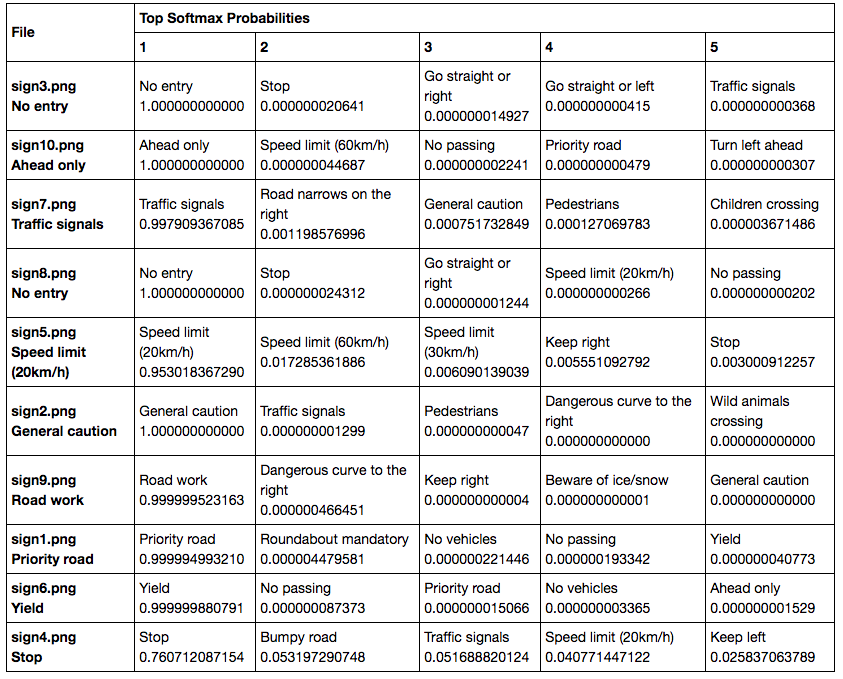

# **Traffic Sign Recognition** 

This repository contains an an IPython Notebook with the code for Traffic Sign Recognition Model, an html file displaying the results, and a write-up (this file).

---

**Build a Traffic Sign Recognition Project**

The goals / steps of this project are the following:
* Load the data set (see below for links to the project data set)
* Explore, summarize and visualize the data set
* Design, train and test a model architecture
* Use the model to make predictions on new images
* Analyze the softmax probabilities of the new images
* Summarize the results with a written report

## Rubric Points
###Here I will consider the [rubric points](https://review.udacity.com/#!/rubrics/481/view) individually and describe how I addressed each point in my implementation.  

---
### Submission Files:
The IPython [IPython Notebook](https://github.com/jingxia/CarND-Traffic-Sign-Classifier-Project/blob/master/Traffic_Sign_Classifier.ipynb), [html file](https://github.com/jingxia/CarND-Traffic-Sign-Classifier-Project/blob/master/Traffic_Sign_Classifier.html), and [writeup](https://github.com/jingxia/CarND-Traffic-Sign-Classifier-Project/blob/master/writeup_template.md) are provided.

### Dataset Summary
I calculate the stats of the dataset as follow:
Number of training examples = 34799
Number of testing examples = 12630
Image data shape = (32, 32)
Number of classes = 43

Here is an exploratory visualization of the data set. It is all 43 signs:

### Preprocessing
All images were normalized to ease the numerical optimization. Also all images are converted to greyscale. Both rgb and greyscale are tried to build the model, but greyscale outperforms and runs much faster, so final model is built on top of greyscale. 

### Model Architecture
I used LeNet without any modifications as the start point. This give me ~89% accuracy on validation dataset, not satisfying. Given the fact that there are in total 43 classes in the end, there should be more basic features being selected in the first steps. Thus, increase the depth of the first and second conv layer to enable learning more basic features. This improves model performance to ~92% but still not very good. Tried several architectures, but finally found that adding 2 additional fully-conneted layers at last would help a lot -- model performance on validation is now 98%! Test accuracy is now 96.4%. 

During model training, it is found that learning rate should be smaller, and 0.001 gives a fine tuned model without lengthening the training time too much. To accelarate the training, I also set a target accuracy 0.98. When model achieves at least 0.98 accuracy on validation set, training will stop and model will be saved. 

My final model consisted of the following layers:

| Layer         		|     Description	        					| 
|:---------------------:|:---------------------------------------------:| 
| Input         		| 32x32x1 Greyscale image   							| 
| Convolution 5x5     	| 1x1 stride, valid padding, outputs 28x28x20 	|
| RELU					|												|
| Max pooling	      	| 2x2 stride,  outputs 14x14x20 				|
| Convolution 5x5     	| 1x1 stride, valid padding, outputs 10x10x80 	|
| RELU					|												|
| Max pooling	      	| 2x2 stride,  outputs 5x5x80 				|
| Flatten		| output 2000        									|
| Fully connected		| output 500        									|
| RELU					|												|
| Dropout					|												|
| Fully connected		| output 160        									|
| RELU					|												|
| Fully connected		| output 84        									|
| RELU					|												|
| Fully connected (final classes)		| output 43        									|

My final model results were:
* validation set accuracy of 98% 
* test set accuracy of 96.4%

### Test a Model on New Images

#### 1. Choose 10 German traffic signs found on the web and provide them in the report. For each image, discuss what quality or qualities might be difficult to classify.

Here are 10 German traffic signs that I found on the web:

 
 
 
 
 
 
 
 
 
 

* All signes are predicted correctly by the model!

#### 2. Describe how certain the model is when predicting on each of the five new images by looking at the softmax probabilities for each prediction. Provide the top 5 softmax probabilities for each image along with the sign type of each probability. (OPTIONAL: as described in the "Stand Out Suggestions" part of the rubric, visualizations can also be provided such as bar charts)

 

Model is very certain for most of the results, except sign 4. It's correctely classified as stop sign, but certainty is only 76%. 
